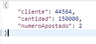
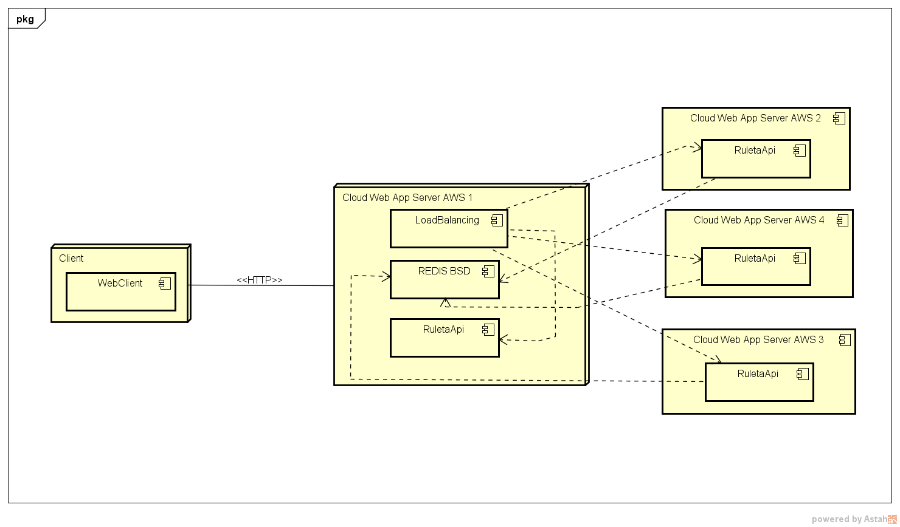

# CleanCode
Proyecto desarrollando por Jonathan Cuesta con los conceptos de CleanCod
## Aplicacion desplegada en AWS en maquina EC2
[http://ec2-18-230-75-201.sa-east-1.compute.amazonaws.com:8080/]
### Enpoinds
Herramienta sugeriada para prueba postman
```
"{id}" hace referencia a el numero de la ruleta ej: "10"
```
* Creación de nuevas ruletas y devuelva el id de la nueva ruleta creada: Metodo Post - url: http://ec2-18-230-75-201.sa-east-1.compute.amazonaws.com:8080/ruletas
* Abrir apuestas dado un id de ruleta: Metodo Patch - url: http://ec2-18-230-75-201.sa-east-1.compute.amazonaws.com:8080/apuestas/{id}/abrir
* Cierre de apuestas dado un id de ruleta: Metodo Patch - url: http://ec2-18-230-75-201.sa-east-1.compute.amazonaws.com:8080/apuestas/{id}/cerrar
* Consultar los ids de las ruletas creadas con sus estados: Metodo Get - url: http://ec2-18-230-75-201.sa-east-1.compute.amazonaws.com:8080/ruletas
* Endpoint para que un usuario pueda apostarle a un numero una cantidad determinada de dinero a una ruleta abierta: Metodo Post - url: http://ec2-18-230-75-201.sa-east-1.compute.amazonaws.com:8080/apuestas/{id}, la peticion debe contener en el Body un objeto JSON como se muestra en la imagen 



### Tecnologias

* Base de datos: Redis
* lenguaje: java 1.8
* framework: Spring boot 2.2.5

### Deploy Diagrams

#### Scalable AWS version

